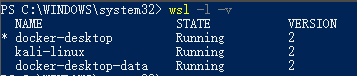

# Install WSL2
> support windows10 dev, home version

1. Downlaod and run [install.bat](https://raw.githubusercontent.com/twfb/install-wsl2/main/install.bat)
2. Download and install [wsl_update_x64.msi](https://wslstorestorage.blob.core.windows.net/wslblob/wsl_update_x64.msi)
3. Downlaod and run [install.bat](https://raw.githubusercontent.com/twfb/install-wsl2/main/install.bat)
4. restart
5. check
    - `wsl -l -v`
    - 
